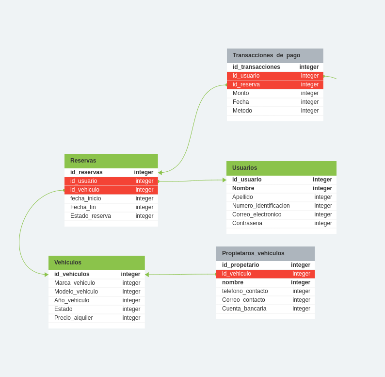
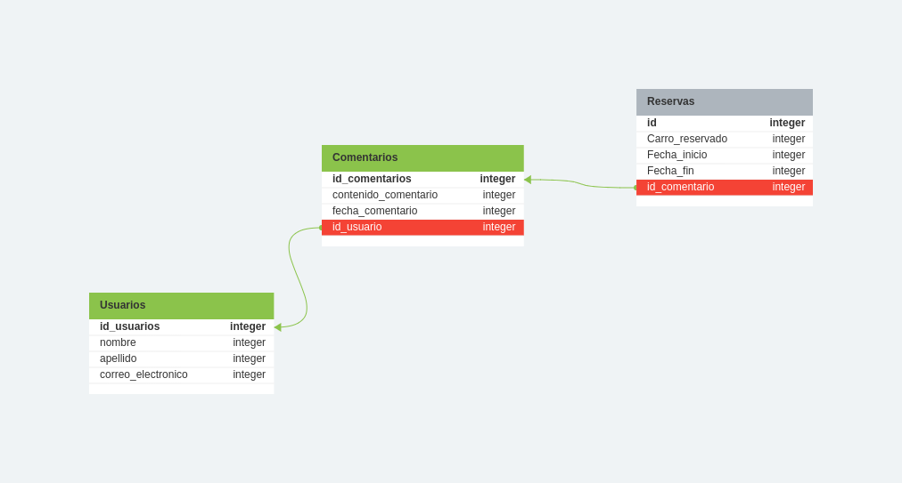

# Gestion de Alquiler de Carros 
En el presente README se demostrara 5 enunciados de modelos conceptuales en el cual se hablara de las necesidades del usuario para gestionar una empresa que alquile vehiculos, 

## Que contiene este repositorio 
* Este repositorio contiene un `README` con toda la informacion pertinente de la base de datos expuesta. 

* Ademas de contener `modelo-de-datos-conceptuales-y-fisico.sql` que es el sql pactado  a partide del modelo fisico `Segundo-enunciado-modelo-de-datos.sql`
tambien es un modelo de tados pertinentes demostrando la ingormacion 

* En el apartado de `images` contiene las dos imagenes para la correcta visualizacion del modelo fisico. 

### Los modelos a trabajar son 
- Modelo conceptual 
- Modelo lógico
- Modelo fisico

### Como se trabajaran 

 A partir de los tres modelos demostrados anteriormente se trabajaran de la siguiente manera.
 1. Primero planteamos una idea Preliminar para determinar el concepto o las ideas que quereamos plantear en la estructura de la base de datos y de las gestion de alquiler de los vehiculos 
 2. A partir de la logica enunciada en el cual se planteara el problema a solucionar o la idea que queramos plantear se desarrollara una lluvia de ideas por parte del usuario/cliente para suplir las necesidades expuestas. 
 3. A partir de las 5 enunciados en las anteriores fases tomaremos 2 de los mismos para realizar su respectivo modelo fisico, planteando la base de datos para demostrar y plasmar las ideas del cliente. 


## Enunciados/ Modelo logico 

### 1. Control de usuarios 
 El sistema de gestion de alquiler de carros permite a los usuarios registrarse, buscar vehiculos disponibbles y reservarlos de manera conveniente.
### 2. Interaccion con el tipo de vehiculo 
 En la plataforma los usuarios pueden seleccionar las fechas de inicio y finalizacion del tiempo de uso del vehiculo, ademas de poder elegir el tipo de vehiculo que desee, como coches, camionetas o motocicletas, por usuario solo se puede alquilar un tipo de vehiculo a la vez 
### 3. Ser parte de la plataforma
 En la plataforma podemos ofrecer un servicio en el cual dueños de vehiculos puedan enlistar los mismos para ofrecer el servicio con sus vehiculos, ellos podran establecer tarifas y gestionar la disponibilidad de acuerdo a su horario y ubucacion. 
### 4. Pagos en linea 
Los usuarios pueden realizar pagos en linea, escoger el tipo de pago y ademas recibir confirmacion de la reserva, esta incluye detalles del vehiculo y la ubicacion de recogida 
### 5. Calificaciones por usuarios
El sistema incluye un sistema de comentarios o retroalimentacion, asi los usuarios podran calificar y compartir su experiencia con otros usuarios y asi poder recibir comentarios acerca de su servicio. 

## Modelo conceputal
El modelo de datos conceptual generalmente registra entidades y del como estas se relacionan entre si para el correcto funcionamiento 
####  Califiacion de usuarios 
##### Entidades Principales
1. Usuarios: Esta es representada por atibutos como:
    * Nombre: Identificacion por nombre del usuario
    * Apellido: Identificacion del usuario por Apellido
    * Correo Electronico: Correo electronico de contacto y de registro del usuario

2. Comentarios:
     * Contenido comentarios:Contenido del cometario u opinion del usuario
     * Fecha comentario: Fecha de la publicacion del comentario. 
     * Id_usuario: Clave foranea para relacion con los usuarios. 
     * Contraseña: Esta es la forma del usuario poder entrar a la plataforma 


### La tabla seria algo asi: 
| Tipo   | Clave  | Descripcion | 
| :---         |     :---:      |          ---: |
| id_usuarios| Clave primaria   | Identificacor unico de la reserva    |
| nombre    |        | Identificacion de contacto po nombre     |
| Apellido        |         |Idenficicacion de contacto por apellido     |
| Correo_electronico   |       |Correo de registro y contacto     |
####  Control de usuarios 
##### Entidades Principales
1. Reserva: Esta es representada por atibutos como:
    * Fecha_inicio: En la cual se distribuira la fecha de inicio de la reserva del vehiculo.
    * Fecha_fin: En la cual se pactara la fecha final del uso de la reserva del vehiculo.
    * Estado_reserva: estado en el cual la reserva se encuentra; aprovada/finalizada/cancelada

2. Usuarios:
     * Nombre: Nombre por cual se identifica al usuario.
     * Apellido: Apellido por el cual se identifica el usuario. 
     * Numero_identificacion: Esta es el correo de contacto con el usuario y de registro para la aplicacion. 
     * Contraseña: Esta es la forma del usuario poder entrar a la plataforma 
3. Vehiculos:
    * Marca_vehiculo: Es la marca del vehiculo que se va a alquilar.
    * Modelo_vehiculo: Es el modelo/año del vehiculo que se va a alquilar.
    * Año_vehiculo : El año de creacion del vehiculo 
    * Estado : Estado en el cual se encuentra el vehiculo (Aceptable/perfecto/deplorable)
    * Precio_alquiler: precio en el cual se basara el alquiler.

### La tabla seria algo asi: 
| Tipo   | Clave  | Descripcion | 
| :---         |     :---:      |          ---: |
| id_reserva| Clave primaria   | Identificacor unico de la reserva    |
| Fecha_inicio    |        | Fecha inicio de la reserva     |
| Fecha_fin        |         |Fecha final de la reserva     |
| Estado_reserva    |       |Estado actual de la reserva     |


# Modelo fisico 
En este caso escogemos el primer enunciado para desarrollar su correcto modelo fisico a base de tablas (filas y columnas)y tambien escogeremos el quinto enunciado. 

### Primer enunciado
##### ("El sistema de gestion de alquiler de carros permite a los usuarios registrarse, buscar vehiculos disponibbles y reservarlos de manera conveniente".)




### Quinto enunciado 

##### ("El sistema incluye un sistema de comentarios o retroalimentacion, asi los usuarios podran calificar y compartir su experiencia con otros usuarios y asi poder recibir comentarios acerca de su servicio. ")




# Bases de datos 

### Pimer enunciado
``` Vehiculos {
	id_vehiculos integer pk increments
	Marca_vehiculo integer
	Modelo_vehiculo integer
	Año_vehiculo integer
	Estado integer
	Precio_alquiler integer
}

Usuarios {
	id_usuario integer pk increments
	Nombre integer pk increments
	Apellido integer
	Numero_identificacion integer
	Correo_electronico integer
	Contraseña integer
}

Reservas {
	id_reservas integer pk increments
	id_usuario integer > Usuarios.id_usuario
	id_vehiculo integer > Vehiculos.id_vehiculos
	fecha_inicio integer
	Fecha_fin integer
	Estado_reserva integer
}

Propietaros_vehiculos {
	id_propetario integer pk increments
	id_vehiculo integer > Vehiculos.id_vehiculos
	nombre integer pk increments
	telefono_contacto integer
	Correo_contacto integer
	Cuenta_bancaria integer
}

Transacciones_de_pago {
	id_transacciones integer pk increments
	id_usuario integer > Usuarios.id_usuario
	id_reserva integer unique > Reservas.id_reservas
	Monto integer
	Fecha integer
	Metodo integer
} 
```
 ### Quinto enunciado
```
Usuarios {
	id_usuarios integer pk increments
	nombre integer
	apellido integer
	correo_electronico integer
}

Comentarios {
	id_comentarios integer pk increments
	contenido_comentario integer
	fecha_comentario integer
	id_usuario integer > Usuarios.id_usuarios
}

Reservas {
	id integer pk increments
	Carro_reservado integer
	Fecha_inicio integer
	Fecha_fin integer
	id_comentario integer > Comentarios.id_comentarios
}
```

